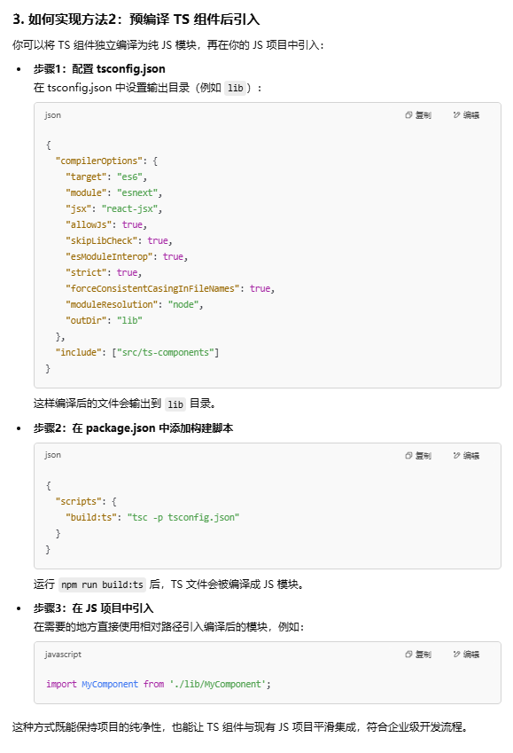
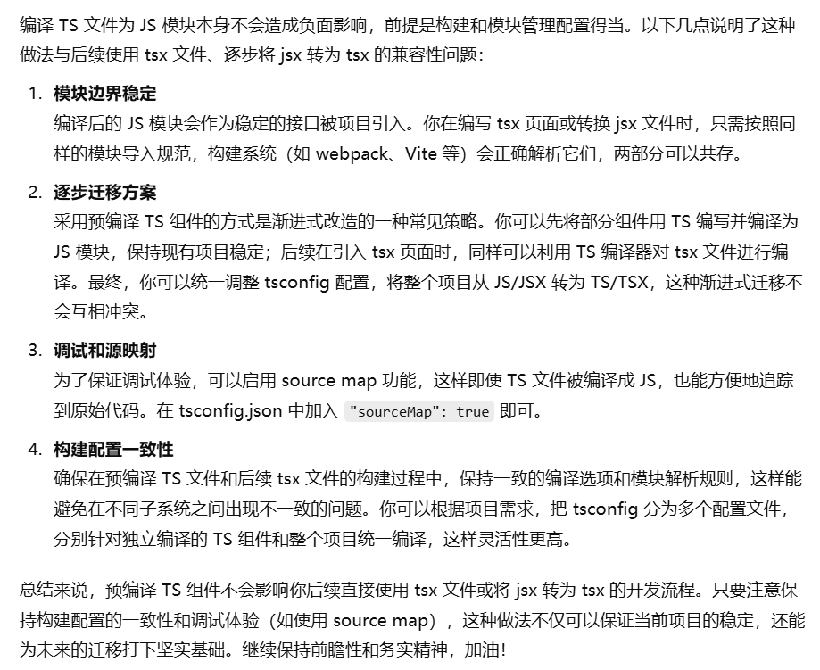

# frontend

前端仓库

## github: https://github.com/04megumi/frontend

## 一 环境说明

OS: Windows 10
npm version: 10.9.2
yarn version: 1.22.22
node version: v22.14.0
vite version: 6.2.6
react 19
react-dom: ^19.0.0
axios: ^1.8.4
tailwindcss: v4.1.3

## 二 开发组件说明

SpringBoot: 3.4.3
组件:Lombok

## 三 启动流程

### 本地

npm install
npm run dev

### 服务器

TODO

## 四 TS预编译



### 在JS项目中引入

在需要的地方直接使用相对路径引入编译后的模块，例如：

</button></span></div></div></div><div class="overflow-y-auto p-4" dir="ltr"><code class="!whitespace-pre language-javascript"><span><span>import</span><span> </span><span>MyComponent</span><span> </span><span>from</span><span> </span><span>'./lib/MyComponent'</span><span>;</span></span></code></div></div></pre>



## TODO 依赖

### 1、Framework：

npm create vite@latest

### 2、Typescript 依赖安装：

node -v
npm -v

npm install --save-dev typescript @types/react @types/react-dom

### 3、Tailwind CSS 安装：

1.tailwind css 4

https://tailwindcss.com/docs/installation/using-vite

检查版本：npm ls tailwindcss

2.tailwind css 3：

node -v
npm -v

npm install -D tailwindcss@3.4.17 postcss autoprefixernpm install tailwindcss postcss autoprefixer
npx tailwindcss init -p

或手动添加配置文件 tailwind.config.js, postcss.config.js

创建css文件，确保在项目中有一个主 CSS 文件（例如 `src/input.css`），并在其中包含 Tailwind CSS 的指令：

@tailwind base;
@tailwind components;
@tailwind utilities;

3、升级到tailwind css 4：

npx @tailwindcss/upgrade

## 规范化Tree

一个标准化的前端开发项目通常会遵循一定的目录结构，以确保代码的组织清晰、易于维护和扩展。以下是一个典型的前端项目目录结构示例：

```
my-project/
├── public/                  # 静态资源目录
│   ├── favicon.ico          # 网站图标
│   ├── index.html           # HTML 模板文件
│   └── manifest.json        # 应用清单文件（可选）
├── src/                     # 源代码目录
│   ├── assets/              # 静态资源
│   │   ├── images/          # 图片
│   │   ├── fonts/           # 字体
│   │   └── videos/          # 视频
│   ├── components/          # 可复用的组件
│   │   ├── Button/
│   │   │   ├── Button.jsx
│   │   │   ├── Button.module.css
│   │   │   └── index.js
│   │   └── Header/
│   │       ├── Header.jsx
│   │       ├── Header.module.css
│   │       └── index.js
│   ├── pages/               # 页面组件
│   │   ├── HomePage/
│   │   │   ├── HomePage.jsx
│   │   │   └── index.js
│   │   └── AboutPage/
│   │       ├── AboutPage.jsx
│   │       └── index.js
│   ├── styles/              # 全局样式
│   │   ├── base.css         # 基础样式
│   │   ├── variables.css    # 样式变量
│   │   └── main.css         # 主样式表
│   ├── utils/               # 工具函数
│   │   └── helpers.js
│   ├── api/                 # API 调用
│   │   └── api.js
│   ├── hooks/               # 自定义钩子
│   │   └── useFetch.js
│   ├── context/             # React 上下文
│   │   └── ThemeContext.js
│   ├── App.jsx              # 应用入口组件
│   ├── index.jsx            # 渲染入口文件
│   └── vite.config.js       # Vite 配置文件
├── .gitignore               # Git 忽略文件
├── package.json             # 项目配置文件
├── tailwind.config.js       # Tailwind CSS 配置文件
├── postcss.config.js        # PostCSS 配置文件
├── README.md                # 项目说明文件
└── tsconfig.json            # TypeScript 配置文件（如果使用 TypeScript）
```

### 详细说明

- **public/**：包含静态资源，如 `favicon.ico` 和 `index.html`。
- **src/**：包含项目的源代码。
  - **assets/**：存放静态资源，如图片、字体和视频。
  - **components/**：存放可复用的组件。
  - **pages/**：存放页面组件。
  - **styles/**：存放全局样式文件。
  - **utils/**：存放工具函数。
  - **api/**：存放 API 调用相关代码。
  - **hooks/**：存放自定义钩子。
  - **context/**：存放 React 上下文。
  - **App.jsx**：应用的入口组件。
  - **index.jsx**：渲染入口文件。
  - **vite.config.js**：Vite 配置文件。
- **.gitignore**：指定 Git 忽略的文件和目录。
- **package.json**：项目依赖和脚本配置。
- **tailwind.config.js**：Tailwind CSS 配置文件。
- **postcss.config.js**：PostCSS 配置文件。
- **README.md**：项目说明文件。
- **tsconfig.json**：TypeScript 配置文件（如果使用 TypeScript）。

### 注意事项

- **一致性**：确保团队成员遵循相同的目录结构和命名规范。
- **模块化**：将代码按功能模块化，便于维护和扩展。
- **文档**：提供清晰的项目文档，帮助团队成员快速上手。

通过以上结构，你可以创建一个标准化的前端项目，确保代码的组织清晰、易于维护和扩展。
